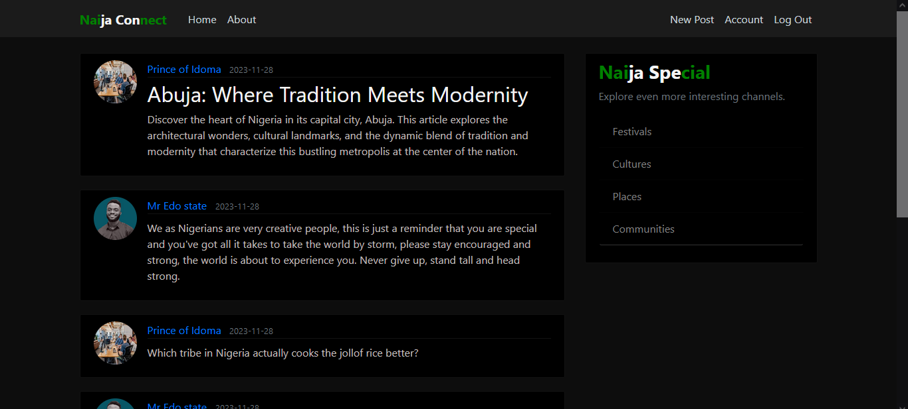

# Naija Connect: Microblogging Platform

Naija Connect is a dynamic microblogging platform designed to bring Nigerians together, fostering connections and conversations in one vibrant online community. Whether you're sharing updates, exploring cultural heritage, or discovering local festivals, Naija Connect is your go-to destination.

## Features

- **User Registration and Authentication**: Seamlessly sign up and log in to your personalized account.
- **User Profiles**: Customize your profile, edit your information, and connect with other users.
- **Password Reset**: Easily reset your password in case you forget it.
- **Post Creation**: Share your thoughts, experiences, and insights with the Naija Connect community.
- **Post Interaction**: Like, comment, and engage with posts from fellow users.
- **Upcoming Features**: Exciting upcoming channels including festivals, culture, places, and communities will soon enrich your Naija Connect experience.

## Installation

To run Naija Connect locally:

1. Clone this repository to your local machine.
2. Install dependencies using `pip install -r requirements.txt`.
3. Set up environment variables including database configurations and secret keys.
4. Run the application using `python app.py`.
5. Access the application via your web browser at `http://localhost:5000`.

## Technologies Used

- Python
- Flask Framework
- HTML
- CSS
- Bootstrap
- SQLAlchemy (SQlite Database)
- Flask-Mail (for email functionality)
- Flask-Bcrypt (for password hashing)
- Flask-Login (for user authentication)
- JWT (JSON Web Tokens) for enhanced security

## Planned Features

Stay tuned for upcoming features including:

- **Festivals Channel**: Explore Nigeria's vibrant festival culture.
- **Culture Channel**: Dive into the diverse cultural heritage of Nigeria.
- **Places Channel**: Discover hidden gems and popular destinations across Nigeria.
- **Communities Channel**: Connect with like-minded individuals in various interest groups.

## Contributions

Contributions to Naija Connect are welcome! Feel free to submit pull requests for bug fixes, new features, or improvements. Please refer to the [Contribution Guidelines](CONTRIBUTING.md) for more details.

## License

This project is licensed under the MIT License - see the [LICENSE](LICENSE) file for details.

---

Naija Connect is your window to Nigeria's rich cultural tapestry and vibrant community life. Join us on this exciting journey of connection and discovery!

For any inquiries or feedback, please contact us at [igomigofatai@gmail.com](mailto:igomigofatai@gmail.com).

